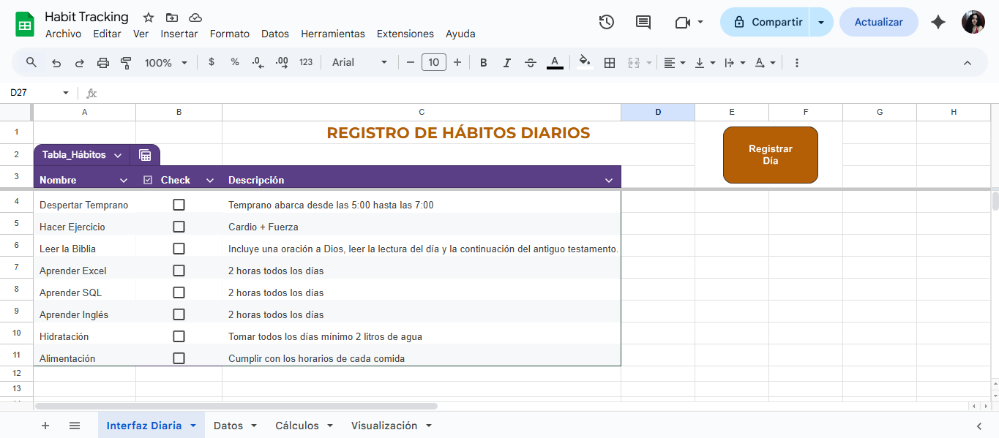

# Habit Tracking Analytics

Proyecto para analizar hábitos diarios, KPIs de cumplimiento y desempeño, comparativas mensuales/anuales y progreso visual.

## Cómo usar

1. Subir el archivo a Google Sheets o Excel.
2. Para Google Sheets: Extensiones → Apps Script → pegar `codigo_AppScript.gs`.
3. Para Excel: habilitar macros y pegar `codigo_ScriptExcel`.
4. Agregar hábitos en la hoja **Interfaz Diaria**.
5. Presionar el botón **Registrar Día** al final del día.

## Métricas principales

- Porcentaje de cumplimiento / no cumplimiento (KPI)
- Hábitos con mejor/peor desempeño
- Días que más se cumplen hábitos
- Comparativa mensual y anual
- Línea de progreso acumulada
